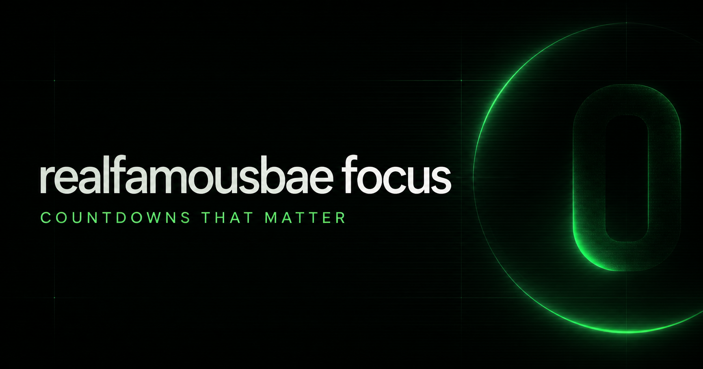

# realfamousbae focus

Beautiful, private countdowns for the moments that matter. Create a timer, keep it synchronized across devices with ChatGPT sign-in, or bring in a calendar in a couple of clicks.

**Website:** [realfamousbae-focus.multihead-la-3424.chatgpt.site](https://realfamousbae-focus.multihead-la-3424.chatgpt.site)



## What it does

- Creates live countdown timers with optional notes and color accents.
- Keeps timers private to the signed-in ChatGPT user and syncs them through Cloudflare D1.
- Imports upcoming events from `.ics`, `.ical`, and Google Calendar `.csv` files.
- Handles recurring calendar events, exclusions, duplicates, time zones, and a one-year import horizon.
- Offers Russian and English interfaces, with the preferred language remembered locally.

## Stack

Next.js 16 · React 19 · TypeScript · Vinext/Vite · Cloudflare Workers & D1 · Drizzle ORM

## Run locally

Requires Node.js 22.13 or later.

```bash
npm install
npm run dev
```

Useful checks:

```bash
npm test
npm run lint
npm run build
```

The production experience expects the ChatGPT authentication headers and a Cloudflare D1 binding named `DB`; the landing page can still be viewed without signing in.

## Data and privacy

Each timer is stored with its authenticated owner ID. API routes require ChatGPT authentication, and all timer queries are scoped to that owner.

## Project layout

```text
app/        UI, authentication helpers, and timer API routes
db/         Drizzle schema and D1 access
drizzle/    Database migration history
public/     Brand and social-preview assets
```

## License

[MIT](LICENSE) © 2026 realfamousbae
